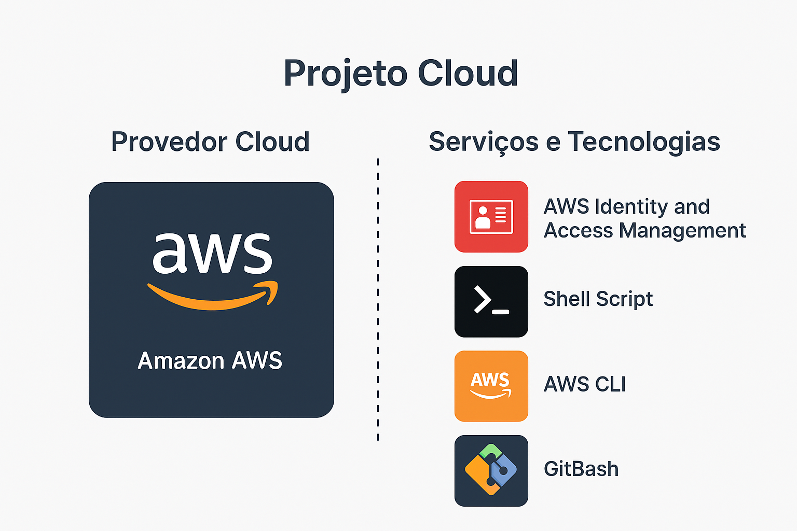
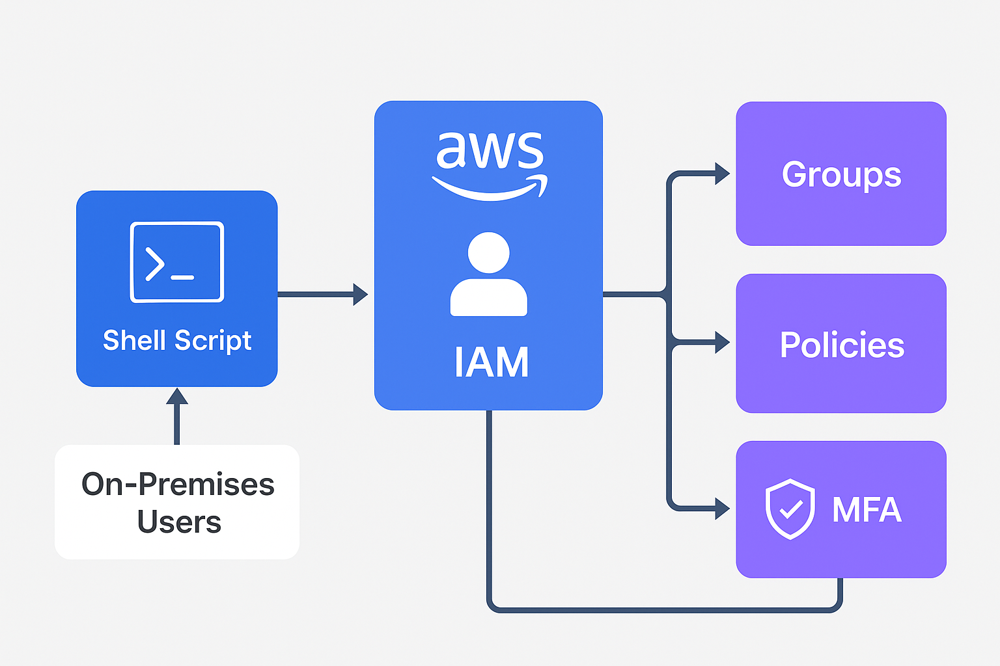
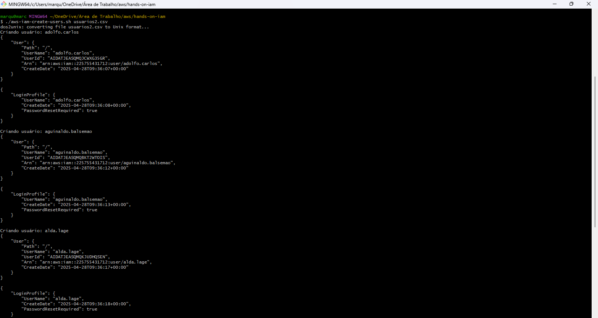
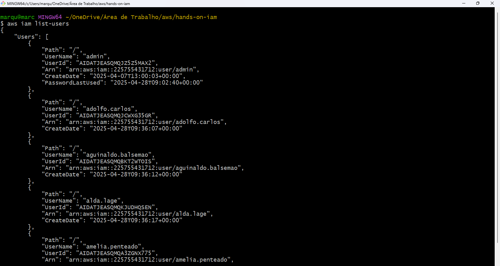
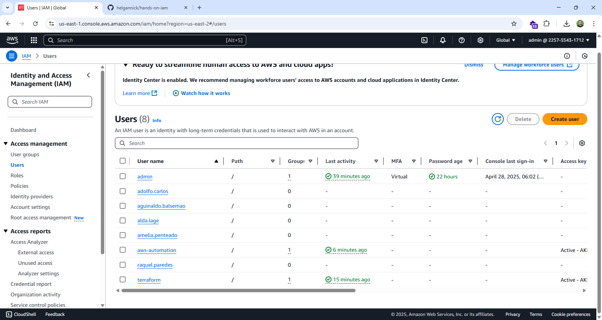

# 🚀 Projeto Cloud - Automação de Criação de Usuários IAM na AWS

---

## 📄 Descrição do Projeto

Este projeto foi desenvolvido para automatizar a criação de usuários IAM (Identity and Access Management) na Amazon AWS, a partir de usuários locais (on-premises).  
Utilizando **Shell Script** e **AWS CLI**, o processo inclui a criação de usuários, definição de políticas, organização em grupos e configuração de MFA (autenticação multifator), tudo de forma segura e eficiente.

---

## 🛠️ Tecnologias e Serviços Utilizados

- **Amazon AWS** como provedor de serviços Cloud
- **AWS IAM** para gestão de identidades e acessos
- **AWS CLI** para interação com a AWS via terminal
- **Shell Script** para automação de processos
- **Git Bash** para execução dos scripts no ambiente local

---

## 🖥️ Arquitetura do Projeto

O fluxo funciona da seguinte maneira:
- Captura de informações dos usuários locais
- Criação de usuários na AWS IAM
- Definição de políticas de acesso apropriadas
- Adição dos usuários a grupos predefinidos
- Configuração obrigatória de MFA para segurança

---

## 📂 Organização do Projeto

Estrutura de diretórios:

- **scripts/**: Contém os scripts de automação.
- **docs/**: Documentação e imagens utilizadas.
- **README.md**: Este arquivo de documentação.

---

## ⚙️ Funcionamento

O script realiza:
- Leitura dos usuários de um arquivo `.csv` ou entrada manual
- Criação de usuários no IAM com configuração inicial
- Atribuição de políticas customizadas
- Ativação da autenticação multifator (MFA)

